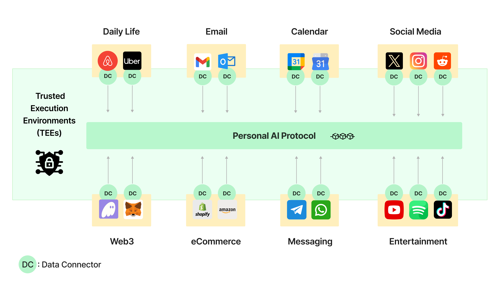

Data Connectors are software components that fetch and organize user data from external sources into a structured format that on-device LLMs can utilize for Personal AI and agent services. They are hosted by a decentralized network of TEE Node Operators and are accessible to users via the PIN AI app.

Connectors provide the following services:
- Secure data collection from sources like social media, email, Web3 wallets, and shopping apps.
- Private data preprocessing within Trusted Execution Environments (TEEs).
- Cryptographic attestation of data preprocessing, verified by the PIN Onchain Protocol.

## How they work

Users select Data Connectors to collect and preprocess their data so that it is readily accessible to their Personal AI. The process consists of the following steps:

<Steps>
  <Step title="Data Collection">
    Connectors securely fetch and process user data from authorized sources (e.g., social media, Web3 wallets, shopping apps), ensuring privacy and preventing unauthorized access.
    <ul>
      <li>Verified data sources (Gmail, social media, e-commerce, crypto wallets, etc.).</li>
      <li>Interaction history and past responses.</li>
      <li>Activity patterns and behavioral trends.</li>
    </ul>
  </Step>
  
  <Step title="Preprocessing">
    Retrieved data is cleaned, formatted, and structured into a graph, optimizing it for efficient retrieval and AI processing.
  </Step>
  
  <Step title="Onchain Verification">
    Connectors ensure the integrity and authenticity of operations performed within TEE nodes by submitting a hardware-generated attestation report to the PIN Onchain Protocol. These reports confirm that:
    <ul>
      <li>The TEE node has completed the assigned task.</li>
      <li>The code running inside the TEE is the version certified by the Personal AI Protocol, ensuring no alterations to the software or environment.</li>
    </ul>
    These attestation reports are submitted to the PIN Onchain Protocol for verification, ensuring that:
    <ul>
      <li>The TEE environment operates as intended and securely processes personal data.</li>
      <li>The integrity of the software and Data Connectors' operations is maintained without exposing sensitive user information.</li>
    </ul>
  </Step>
  
  <Step title="Storage">
    After verification, preprocessed data is securely stored in a user-designated trusted storage space. This storage could be the user’s local devices or private cloud. This ensures privacy, local control, and direct accessibility for Personal AI.
  </Step>
</Steps>

## Important features

- **Privacy-preserving data handling:**
All data fetching and processing occur exclusively within a TEE node, unless otherwise authorized by the user. This prevents unauthorized access or data leakage.

- **User-controlled access:**
Users retain full control over which Data Connectors can access their apps and under what conditions. Data fetching is customizable based on user-defined parameters, such as scheduled updates or on-demand fetching.